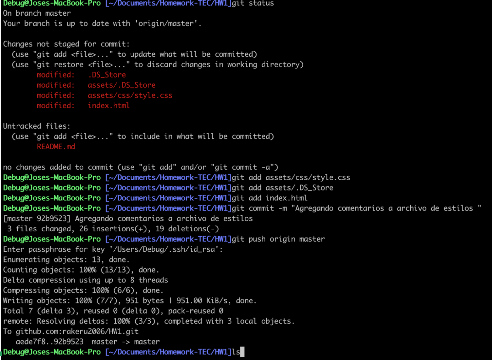
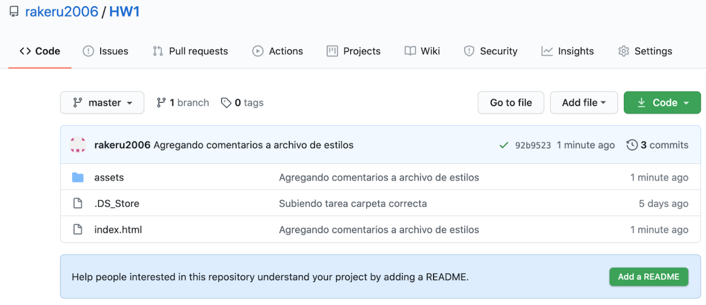
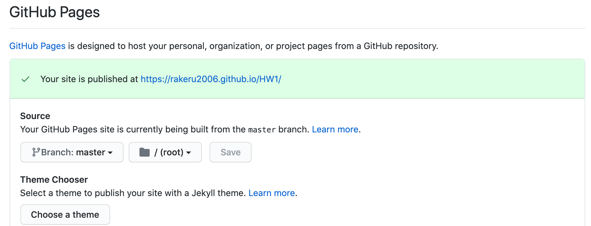
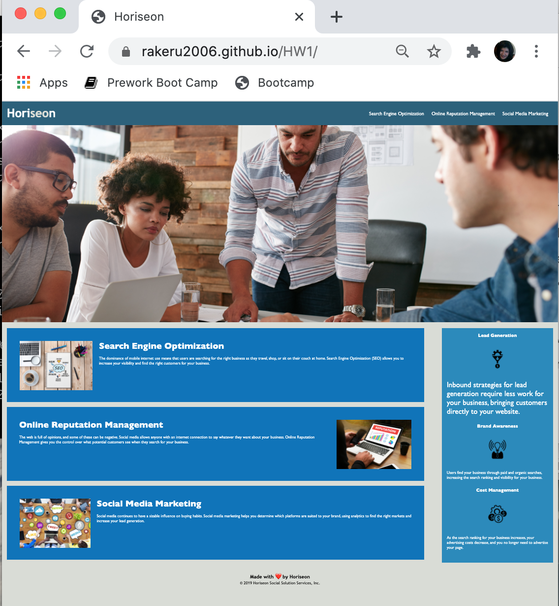

# Home Work 01 HTML CSS Git: Code Refactor

## Task

**Note**: Be sure to review the [Homework Guide](../04-Important/Homework-Guide/README.md) and the [Good README Guide](../04-Important/Good-README-Guide/README.md) before you start working on this assignment!

This week is an odd-numbered week, so your homework is an on-the-job ticket, which means you'll begin with starter code that you need to modify. This week's homework involves a very important aspect of web development: **accessibility**. 

-One of the most common tasks for front-end and junior developers is to take existing code and refactor it (recall that to refactor code is to improve it without changing what it does) to meet a certain set of standards or implement a new technology. In this homework, a marketing agency has hired you to refactor an existing site to make it more accessible._ 

Web accessibility is an increasingly important consideration for businesses. It ensures that people with disabilities can access a website using assistive technologies such as video captions, screen readers, and braille keyboards. Making a website accessible is also good for business for many reasons, one of them being that accessible sites are better positioned in search engines like Google. It also helps companies avoid litigation that can occur when people with disabilities cannot access their website.

Even though accessibility is a broad topic that can include complex requirements, your tech lead has given you a small list of specific criteria to satisfy the project. These criteria are documented below in the Acceptance Criteria.

1. Item 1 **Important**: An important rule to follow when working with someone else's code is the **Scout Rule**, which recommends that you always leave the code a little cleaner than when you found it.

To impress clients, you should always go the extra mile and improve the codebase for long-term sustainability. 

2. Item 2 For example, make sure that all links are functioning correctly.


3. Item 3 Also, rework the CSS to make it more efficient by consolidating CSS selectors and properties, organizing them to follow the semantic structure of the HTML elements, and including comments before each element or section of the page.

Are you ready to jump in? Here are this week's homework requirements:

## User Story

```
AS A marketing agency
 I WANT a codebase that follows accessibility standards
 SO THAT our own site is optimized for search engines
```
4. Item 4 Site is optimized for search engines
```
    <meta charset="UTF-8">
    <meta name="description" content=" Search Engine Optimization (SEO)">
    <meta name="keywords" content=" Management,ranking, Social Media, Marketing ">
    <meta name="author" content=" Horiseon">
    <meta name="viewport" content="width=device-width, initial-scale=1.0">
    <link rel="stylesheet" href="assets/css/style.css">
```

**
## Acceptance Criteria

```
GIVEN a webpage meets accessibility standards
WHEN I view the source code
THEN I find semantic HTML elements
WHEN I view the structure of the HTML elements
THEN I find that the elements follow a logical structure independent of styling and positioning
WHEN I view the image elements
THEN I find accessible alt attributes
WHEN I view the heading attributes
THEN they fall in sequential order
WHEN I view the title element
THEN I find a concise, descriptive title
```

## Mock-Up

The following image shows the web application's appearance and functionality:


## Grading Requirements

This homework is graded based on the following criteria: 

### Technical Acceptance Criteria: 40%

* Satisfies all of the above acceptance criteria plus the following code improvements:

  * Application's links all function correctly.

  * Application's CSS selectors and properties are consolidated and organized to follow semantic structure.

  * Application's CSS file is properly commented.

### Deployment: 32%

* Application deployed at live URL.

* Application loads with no errors.

* Application GitHub URL submitted.

* GitHub repository that contains application code.

### Application Quality: 15%

* Application resembles (at least 90%) screenshots provided in the homework instructions.





### Repository Quality: 13%


* Repository has a unique name. 
[a link](https://github.com/rakeru2006/HW1)
<a href="https://github.com/rakeru2006/HW1">Repositorio Homework1</a>
<a href="https://github.com/rakeru2006/HW1">Github web page Homework1</a>
* Repository follows best practices for file structure and naming conventions.


* Repository follows best practices for class/id naming conventions, indentation, quality comments, etc.

* Repository contains multiple descriptive commit messages.

* Repository contains quality README file with description, screenshot, and link to deployed application.


@octocat :+1: This Repository looks great - it's ready to merge! :shipit:

## Review

You are required to submit the following for review:

* The URL of the deployed application.

* The URL of the GitHub repository. Give the repository a unique name and include a README describing the project.

- - -
© 2020 Trilogy Education Services, a 2U, Inc. brand. All Rights Reserved.
